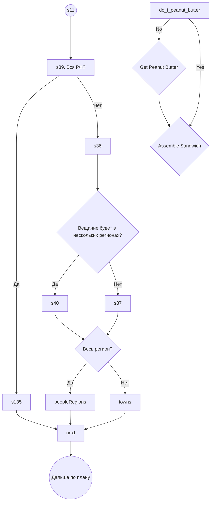

При изменении территории кабель или универсалка (неважно, чистая она или с численностью населения)

#TODO ROBLOX детям скорректировать их работы, что уже сделаны, отладить интерфейс, а также забабахать по красоте им код, что уже раньше был испорчен или сломан (@)