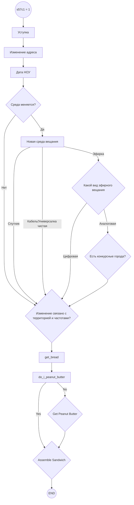

При изменении территории кабель или универсалка (неважно, чистая она или с численностью населения)

```mermaid
flowchart TB
    start_sequence((s57c1 = 1)) --> ustupka[Уступка]
    ustupka --> address[Изменение адреса]
    address --> date[Дата НОУ]
    date --> changeArea{Среда меняется?}
    changeArea -->|Нет| changeTerr{Изменение связано с территорией}
    changeArea -->|Да| newArea[Новая среда вещания]
    newArea -->|Спутник| changeTerr{Изменение связано с территорией}
    newArea -->|Эфирка| nev{Какой вид эфирного вещания}
    newArea -->|Кабель/Универсалка чистая| changeTerr{Изменение связано с территорией}
    nev --> |Аналоговая| analog{Есть конкурсные города?}
    nev --> |Цифровая| changeTerr{Изменение связано с территорией}
    analog --> changeTerr{Изменение связано с территорией и частотами?}
    changeTerr --> get_bread
    get_bread -->   do_i_peanut_butter
    do_i_peanut_butter -->|No| get_peanut_butter{Get Peanut Butter}
    do_i_peanut_butter -->|Yes| assemble{Assemble Sandwich}
    get_peanut_butter --> assemble{Assemble Sandwich}
    assemble --> end_sequence((END))
```

