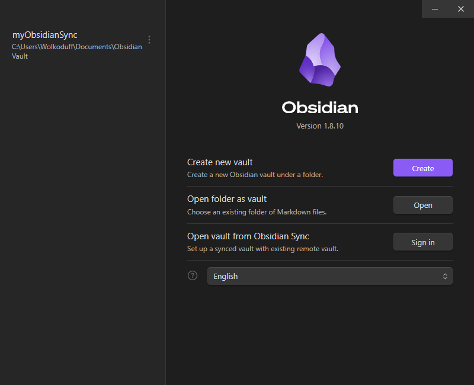
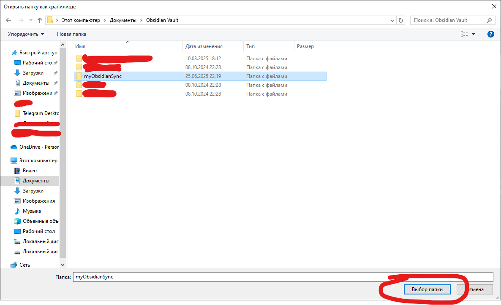
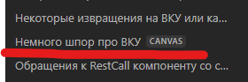

# Это ВКУ

Приветствую всех разработчиков или просто попавших на визуальный конструктор услуг для портала ЕПГУ
Конструктор подразумевался как простое решение low-code или no-code дабы было просто собирать услуги без особых навыков программировании.
Ключевое подразумевался, но как показал опыт - это далеко не так просто, отчего мною было решено попробовать аккумулировать все наработки и интересные кейсы, случаи, события, подсказки, решения, в одном месте

Вместо тысячи слов, можно попробовать найти ответы тут, в этом репозитории, точнее в папке Заметки и инструкции по ВКУ ЕПГУ
Что требуется: 
1) Скачать приложение [Obsidian - Sharpen your thinking](https://obsidian.md/), оно полностью бесплатное, не требует подключения к интернету
2) Скачать этот репозиторий полностью, можно через гит (git clone и ссылку с гита)
3) Периодически проверять обновления этой папки на факт дополнения и выгрузки в неё новых обнаруженных мной штук по конструктору или ещё чему (если скачана через гит, тогда просто периодически делать git pull ну или как там более корректно)

>[!Important] Попадос....
>выявлена была ошибка при загрузке репозитория и его распаковке, попробую тут собрать инструкцию как его настроить и работать с ним корректно

Ключевое после скачивания и указания ссылки на хранилище заметок - открыть Canvas доску "Немного шпор про ВКУ" - там он отобразить должен будет корректно инструкции все, что я накалякал и написал, как и подтянуть картинки с папки "Пикчи"
Принимаю предложения по доработкам и опыту, что есть и хотите им поделиться в личку

### Разбор топика с попадосом выше и ранее:
Шаг первый: скачали обсидиан и поставили его себе спокойно на комп
Шаг второй: open folder as vault или Открыть папку как хранилище (слева на инглише, справа на русском языке, ну или где смотрите, у меня в обсидиане они рядом)

Шаг третий, и он же завершающий - выбираем папку, которую скачали, чтобы он создал в своём управлении хранилищем ссылку на мою эту папочку, точнее репу, и чтобы всё завелось и начало работать хорошо
Выбрать скачанную папку и нажать "Выбор папки", после чего хранилище откроется нормально

Чтобы посмотреть все заметки на одной доске по аналогии с ~~фигнёй~~ Figma-й, нужно открыть доску canvas

Может показаться, что на доске всё будет не очень красиво как хотелось бы, но это уже надо тогда настраивать под себя непосредственно сам obsidian

>[!Note] Некоторые мюсли по всему этому добру или почему решено было упростить жизнь всем и вся через заметки в obsidian-е, а также как с ним работать и его настраивать, сугубо личный опыт
>
>Я могу смело рекомендовать к просмотру данный ролик https://vkvideo.ru/video-219309149_456239303 - или как стать военблогером за несколько простых шагов. 
>Для ознакомления как работать с обсидианом очень даже хорошо, как и настроить его под себя (например, чтобы шапки заметок не заходили в заметки заголовками, а оставались там, где они есть, это всё в начале проходит)
>Если вдруг хотите сделать больше из обычного локального хранилища, то есть различные плагины сообщества (с удовольствием пользуюсь AdvancedTables, Reminder-ом, TODO List-ом, но их на самом деле очень много)
>Есть удобная статья, как сделать из обычного бесплатного обсидиана аналог платного **Notion** [Obsidian+Github вместо Notion: синхронизация, бекап и версионность (3-в-1) / Хабр](https://habr.com/ru/articles/843288/)
>Крутые уроки есть в этой статье (ссылка из статьи выше, но если прям лазить и смотреть) [Obsidian — Notion свободного человека / Хабр](https://habr.com/ru/companies/ozonbank/articles/838990/)
>Скажу сразу - подписка на ваше усмотрение, фишки, что она даёт уже описано как сделать самим в **Obsidian + Github**

>[!Warning] Важное замечание, откуда взяты примеры или что это такое и с чем его едят
>Большинство примеров взято либо с чьих-то случаев, которые мне описывали в личку и мы разбирали их, с меня было решение взамен на условия постановки задачи с желаемым результатом, либо с услуг, которые удалось реализовать
>Если есть возможность смотреть услуги, тогда вот:
>[Лицензирование телевизионного вещания и радиовещания 2.1.0](https://vku.test.gosuslugi.ru/service/60024584/2.1.0/system/SF), версия может отличаться, смотреть последнюю актуальную
>[Аккредитация экспертов и экспертных организаций на право проведения экспертизы информационной продукции 1.0.9](https://vku.test.gosuslugi.ru/service/60014662/1.0.9/system/SF), последняя версия 1.3.5, но там не я автор
>[Услуга для тестов ВКУ 1.0.0](https://vku.test.gosuslugi.ru/service/60028744/1.0.0/system/SF) - основной источник, где я проводил эксперименты на компонентах с отвратительным наименованием компонентов (у меня соглашение следующее для удобства отладки и работы - экран+ид компонента, вроде экран s64, а там 2 компонента - s64c1 (квиз или ввод строки) и s64c2 (UniversalLogic или RestCall запрос или ваще BackRestCall))

Кому-то подача может не подойти, которую я веду в своих инструкциях, но стараюсь минимум духоты, воды и больше практической пользы
Без юмора и мемов обходиться тяжело, иначе можно увидеть как красиво летит ваша кукуха либо свистит фляга

>[!Important] Если совсем туго - СЦ или ЕСКС

На очереди - внедрение витрины МВД, пока ждём ответов, но всё равно я и её распишу со словами "Нам говорят, что так нельзя, а мы говорим, что можно v2"
### Upd: реализовано и залито, но ждём ответа от СЦ на наши тупые вопросы
### Upd2 (01.07.2025): тестовые данные для витрины будут размещены в топике с витриной МВД, как отобразить на экранных формах - ответа не поступило, обидно, но может не так задал вопрос, кому дадут ответ - напишите, скорректирую

Ну или будем честны:

К сожалению...
