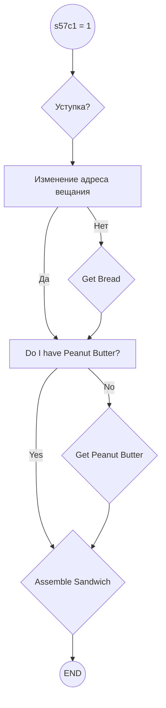

# myObsidianSync
Синхронизация заметок в обсидиане с компом и телефоном

https://habr.com/ru/articles/843288/ - добить на планшет синхронизацию

```mermaid
flowchart TB
    start_sequence((s57c1 = 1)) --> gather_ingredients{Уступка?}
    gather_ingredients --> bread[Изменение адреса вещания]
    bread -->|Нет| get_bread{Get Bread}
    bread -->|Да| do_i_peanut_butter[Do I have Peanut Butter?]
    get_bread -->   do_i_peanut_butter
    do_i_peanut_butter -->|No| get_peanut_butter{Get Peanut Butter}
    do_i_peanut_butter -->|Yes| assemble{Assemble Sandwich}
    get_peanut_butter --> assemble{Assemble Sandwich}
    assemble --> end_sequence((END))
```
