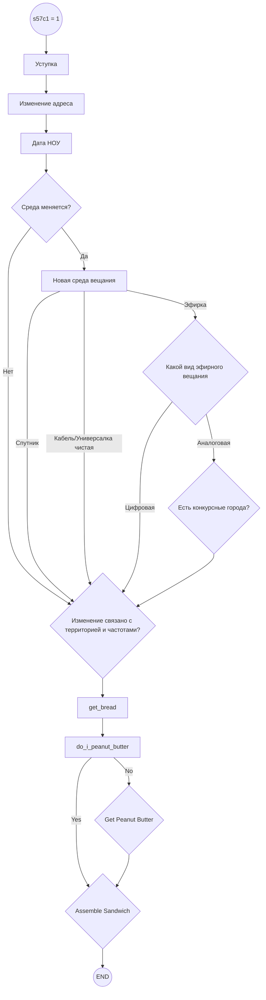
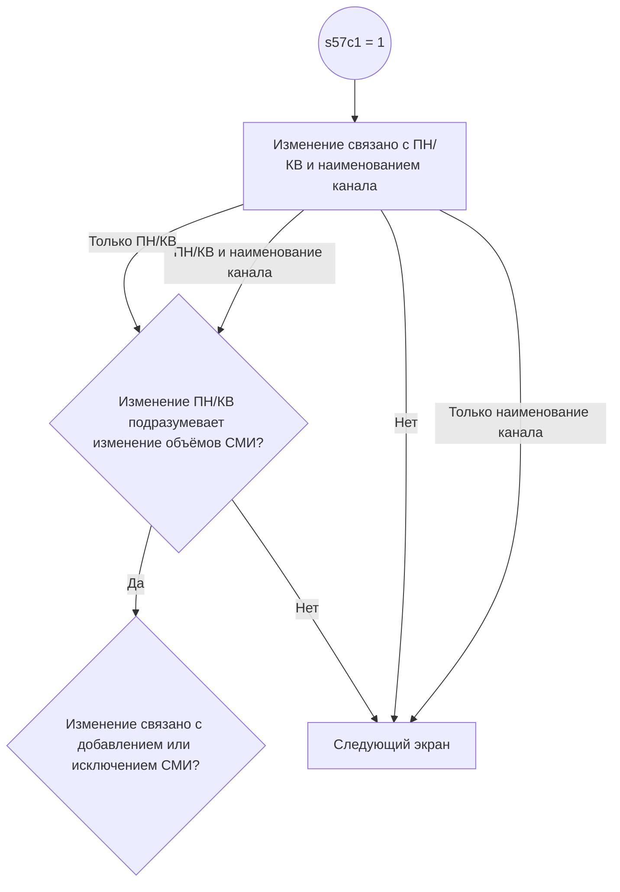

Синхронизация заметок в обсидиане с компом и телефоном

https://habr.com/ru/articles/843288/ - добить на планшет синхронизацию
[Ноутбук HP TPN-C126 / Попросили добавить оперативную память! - смотреть видео онлайн от «Чистка с безупречным блеском» в хорошем качестве, опубликованное 18 ноября 2023 года в 11:55:09.](https://rutube.ru/video/a8b0446b35652519ab062ace7f49666c/?&utm_source=embed&utm_medium=referral&utm_campaign=logo&utm_content=a8b0446b35652519ab062ace7f49666c&utm_term=yastatic.net%2F&referrer=appmetrica_tracking_id%3D1037600761300671389%26ym_tracking_id%3D14652293992110778507)

Протестировать разные ветки, сверить посещение экранов

